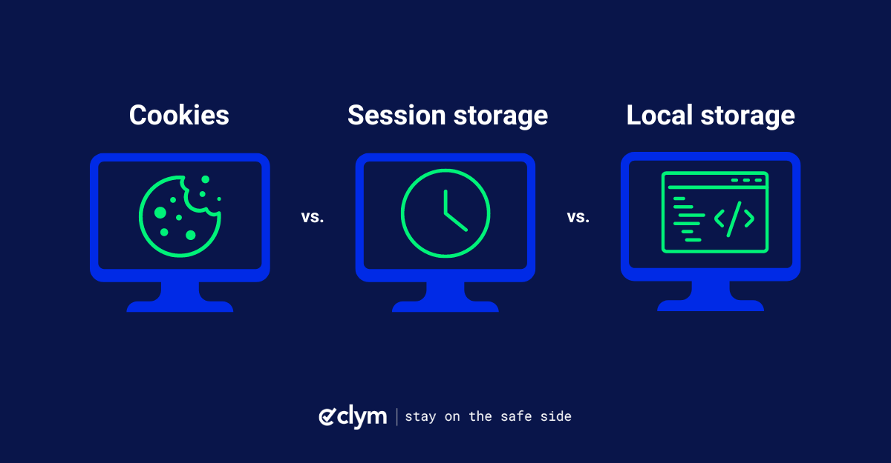

<h1 align="center">🍪 Cookies & Local Storage</h1>

<div align="center">
    
</div>

---

## 📚 Description

This project explores the **core mechanisms of client-side storage** in the browser using **cookies**, **localStorage**, and **sessionStorage**.  
You'll learn how to create and read cookies with raw JavaScript, enhance cookie handling with the **js-cookie** library, and manage web storage for persistent or temporary data.

It includes practical exercises and a **quiz** to assess your knowledge.

---

## 🎯 Learning Objectives

- Understand how to **create cookies** using JavaScript  
- Learn how to set **cookie settings** (expiration, path, etc.)  
- Know how to **read and delete cookies** from the browser  
- Use the **js-cookie** library for easier cookie manipulation  
- Learn the difference between **cookies**, **localStorage**, and **sessionStorage**  
- Understand how to **store and retrieve data** using Web Storage  
- Know when to use each storage type depending on the context

---

## 🧠 Key Concepts

| Feature           | Cookies                 | localStorage           | sessionStorage         |
|------------------|-------------------------|------------------------|------------------------|
| Size limit       | ~4 KB                   | ~5-10 MB               | ~5-10 MB               |
| Lifetime         | Defined by expiration   | Persistent             | Until tab is closed    |
| Sent with HTTP   | ✅ Yes                  | ❌ No                  | ❌ No                  |
| Use case         | Auth, prefs             | Themes, cached data    | Temporary UI state     |

---


## ✅ Requirements

- **Allowed editors**: `vi`, `vim`, `emacs`, **Visual Studio Code**
- All your files must **end with a new line**
- A **README.md** is mandatory at the root of the project
- Your code must use the **.js extension** (except in this project where code is inside `<script>` tags)
- Your code will be executed on **Ubuntu 18.04**, using:
  - `Node.js 12.x`
  - `npm 6.x`

---

## 🔗 Resources

> You are strongly encouraged to read/watch the following:

- [🔗 Cookies and JavaScript](https://developer.mozilla.org/en-US/docs/Web/API/Document/cookie)
- [🔗 HTTP Cookies - MDN](https://developer.mozilla.org/en-US/docs/Web/HTTP/Cookies)
- [🔗 js-cookie Library (GitHub)](https://github.com/js-cookie/js-cookie)
- [🔗 Web Storage API - MDN](https://developer.mozilla.org/en-US/docs/Web/API/Web_Storage_API)

---

## 🚀 Run the Project Locally

To access and run the project locally, follow these steps:

```bash
git clone https://github.com/harishammache/holbertonschool-web_front_end/Cookies_local_storage.git
```

---

## 👨‍💻 Author

**Haris** – Full-Stack Web Developer  

