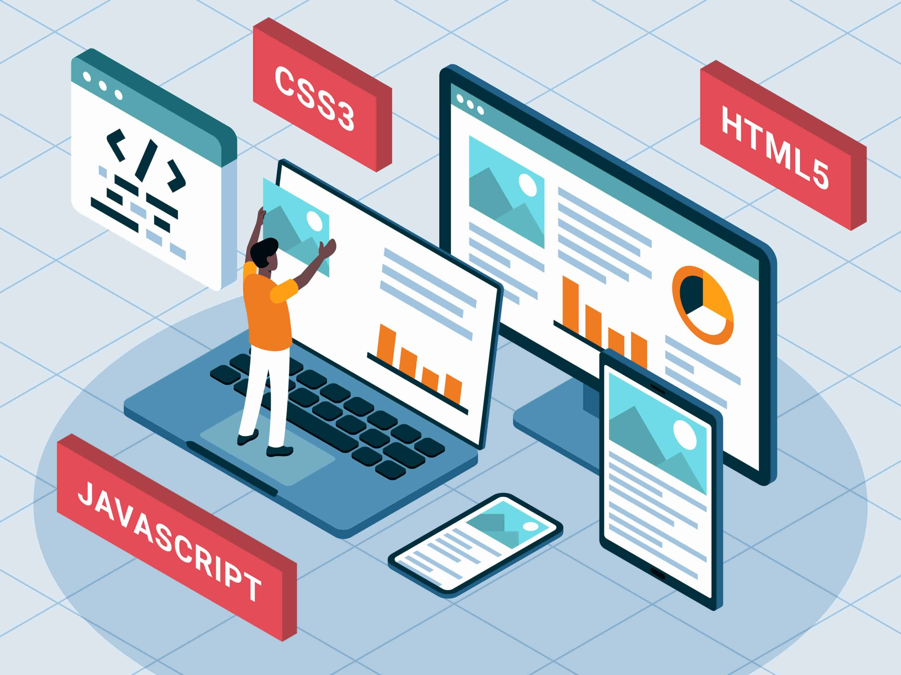

<h1 align="center">Accessibility</h1>

    

## Objectifs d'apprentissage

À la fin de ce projet, vous serez capable d'expliquer à n'importe qui, sans l'aide de Google :

- **Le rôle principal d'ARIA**.
- **Les niveaux de conformité WCAG (A, AA et AAA)**.
- **L'importance de l'accessibilité web**.
- **Les outils à utiliser pour l'accessibilité web**.

---

## Pré-requis

Pour ce projet, vous devez respecter les consignes suivantes :

- Utiliser des éditeurs autorisés : **vi**, **vim**, ou **emacs**.
- Créer un fichier `README.md` à la racine du répertoire du projet (obligatoire).
- S'assurer que le rendu HTML et CSS fonctionne sur **Google Chrome 78 ou plus**.

---

## Ressources Utiles

Voici une liste de ressources utiles pour comprendre et implémenter l'accessibilité web :

- [Accessibility is not a feature. — Ethan Marcotte](https://ethanmarcotte.com/)
- [How to Meet WCAG (Quickref Reference)](https://www.w3.org/WAI/WCAG21/quickref/)
- [Web Accessibility Guidebook for Developers](https://www.accessibility-developer-guide.com/)
- [Testing with assistive technologies - Service Manual - GOV.UK](https://www.gov.uk/service-manual/technology/testing-with-assistive-technologies)
- [A11Y Style Guide](https://a11y-style-guide.com/)
- [Section508.gov | GSA Government-wide IT Accessibility Program](https://section508.gov/)

---

## WCAG - Les Niveaux de Conformité

- **Niveau A** : Conformité minimale (éléments de base requis pour l'accessibilité).
- **Niveau AA** : Conformité médiane (meilleure expérience utilisateur pour la majorité des personnes).
- **Niveau AAA** : Conformité avancée (convient à des besoins spécifiques mais difficile à atteindre pour tous les sites).

---

## Outils pour l'Accessibilité

Voici quelques outils pour tester et améliorer l'accessibilité web :

- **Wave** : Analyse visuelle des erreurs d'accessibilité.
- **Axe DevTools** : Extension pour Chrome/Firefox pour l'analyse des sites.
- **Lighthouse** : Intégré à Chrome pour tester l'accessibilité.
- **NVDA** : Lecteur d'écran gratuit pour Windows.
- **VoiceOver** : Lecteur d'écran intégré à macOS/iOS.

---

## Auteur

Projet réalisé par **Hammache Haris** dans le cadre de la maîtrise des concepts d'accessibilité web.
