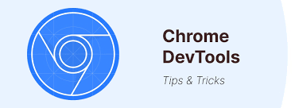

# DevTools


 


## 📖 Description  
Ce projet a pour objectif d'explorer et de maîtriser les outils de développement intégrés (DevTools) des navigateurs modernes tels que Google Chrome, Firefox, Safari et Microsoft Edge.

## 🎯 Objectifs  
- Comprendre l'utilité des DevTools pour le développement web.  
- Utiliser les différentes fonctionnalités des DevTools pour éditer, auditer, et déboguer des pages web.  
- Apprendre à analyser les performances et les configurations des pages web via les DevTools.

## définition des DevTools
Les DevTools (Developer Tools) sont des outils intégrés dans les navigateurs web permettant d'inspecter, éditer et déboguer des pages web en temps réel. Ils aident les développeurs à analyser la structure HTML, le style CSS, le comportement JavaScript, les performances, et les requêtes réseau d'une application web.

## 🛠️ Étapes  
### 1. Ouverture des DevTools  
- **Google Chrome** : `Ctrl+Shift+I` (Windows) ou `Cmd+Option+I` (Mac).  
- **Firefox** : `Ctrl+Shift+I` (Windows) ou `Cmd+Option+I` (Mac).  
- **Safari** : Activer via les préférences > `Develop` > `Show Web Inspector`.  
- **Microsoft Edge** : `Ctrl+Shift+I` (Windows) ou `Cmd+Option+I` (Mac).  

### 2. Exploration des fonctionnalités  
#### a. **Édition de HTML et CSS via l'onglet "Elements"**  
- Modifier la structure HTML directement dans le navigateur.  
- Tester des styles CSS en temps réel.  

#### b. **Auditer la page avec Lighthouse**  
- Lancer un audit pour obtenir des recommandations sur les performances, l'accessibilité, et le SEO.  

#### c. **Utilisation de l'onglet "Console"**  
- Exécuter des commandes JavaScript directement.  
- Déboguer les erreurs affichées dans la console.  

#### d. **Analyse des fichiers et configurations serveur**  
- Inspecter les requêtes réseau via l'onglet "Network".  
- Identifier les fichiers CSS et JavaScript inutilisés.  

### 3. Validation des apprentissages  
- Bloquer des requêtes pour tester le comportement de la page.  
- Détecter et corriger les erreurs 404.  
- Déplacer et manipuler des éléments directement dans la page.  

## 📂 Fichiers inclus  
- **`README.md`** : Ce fichier contenant la documentation du projet.  
- **Captures d'écran** : Illustrations des différentes fonctionnalités explorées.  

## 🚀 Comment utiliser ce projet  
1. Clonez ou téléchargez ce dépôt sur votre machine locale :  
   ```bash
   git clone https://github.com/harishammache/holbertonschool-web-development/tree/main/developer_tools