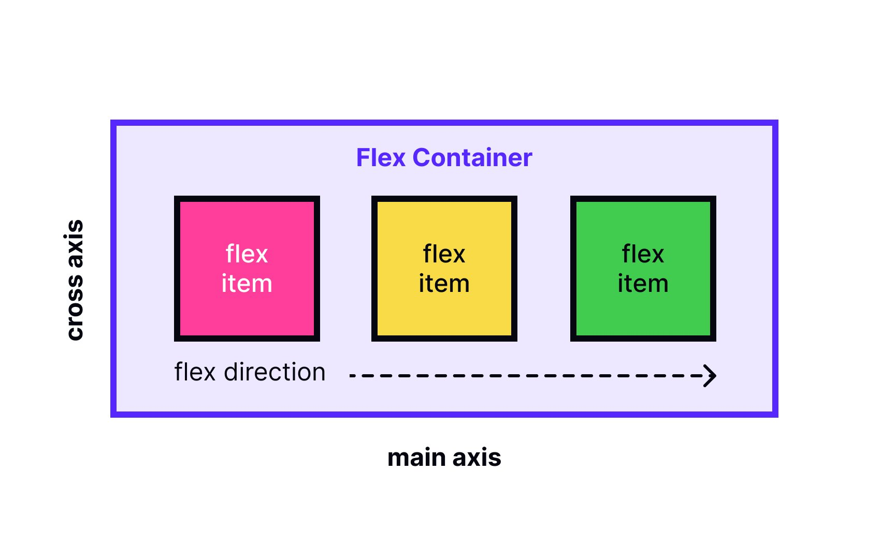

<h1 align="center">Flexbox</h1>
<br>
<div align="center">
    
</div>
<br><br>

Ce projet vise à approfondir la compréhension et l'utilisation de **Flexbox** pour concevoir des pages web modernes et responsives sans avoir recours à des bibliothèques externes. À la fin de ce projet, vous serez capable d'expliquer et d'utiliser Flexbox dans diverses situations.

## Objectifs pédagogiques

À l'issue de ce projet, vous serez en mesure de répondre aux questions suivantes :
- **Qu'est-ce que Flexbox ?**
- Comment convertir un positionnement basé sur des `float` en un affichage avec Flexbox.
- Comment aligner des éléments horizontalement et verticalement à l'aide de Flexbox.
- Quelle est la différence entre l'axe principal (main axis) et l'axe secondaire (cross axis).
- Quelles sont les propriétés applicables aux conteneurs Flex vs aux éléments Flex.
- Quels sont les raccourcis (shorthands) disponibles pour Flexbox.
- Comment concevoir une page en pensant Flexbox dès le début.

## Contraintes et exigences

- Tous les fichiers doivent se terminer par une nouvelle ligne.
- Un fichier `README.md` à la racine du projet est obligatoire.
- **Aucune bibliothèque ou framework externe** n'est autorisé : le site doit être construit uniquement avec **HTML** et **CSS**.
- Les outils comme **NodeJS**, **React**, **VueJS**, ou **Bootstrap** sont strictement interdits.


## Utilisation de Flexbox dans le projet

- Création d'un conteneur flex (`display: flex;`).
- Utilisation des propriétés suivantes pour aligner les éléments :
  - `justify-content`
  - `align-items`
  - `align-self`
- Gestion des axes principaux et secondaires avec `flex-direction` et `flex-wrap`.
- Utilisation des raccourcis tels que `flex` pour définir les proportions des éléments dans le conteneur.

## Ressources utiles

Voici quelques ressources utiles pour approfondir vos connaissances sur Flexbox :
- [CSS-Tricks: A Complete Guide to Flexbox](https://css-tricks.com/snippets/css/a-guide-to-flexbox/) (en anglais)
- [MDN: CSS Flexible Box Layout](https://developer.mozilla.org/fr/docs/Web/CSS/CSS_Flexible_Box_Layout)

## 🚀 Comment utiliser ce projet  
1. Clonez ou téléchargez ce dépôt sur votre machine locale :  
   ```bash
   git clone https://github.com/harishammache/holbertonschool-web_front_end/tree/main/flexbox
