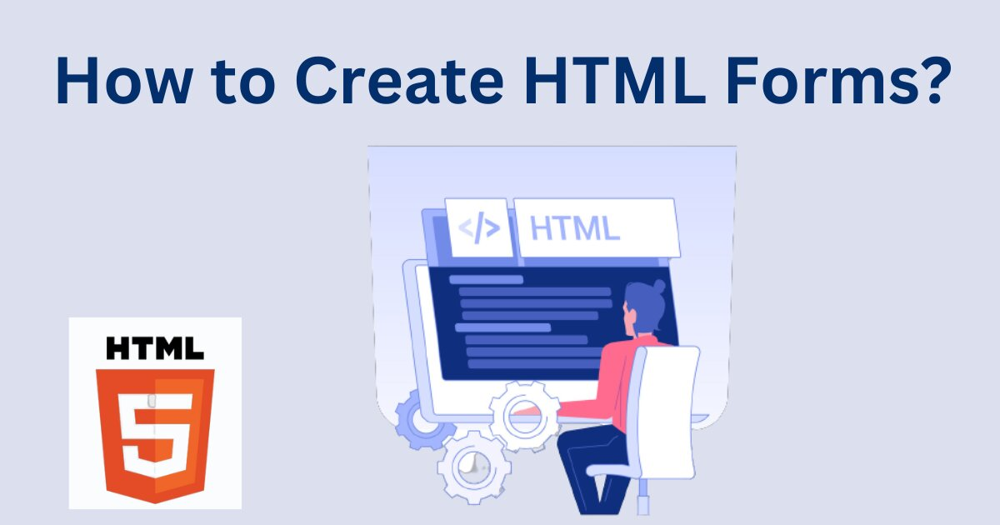

<h1 align="center">Forms</h1>
<div align="center">
    
</div>
## Description

Ce projet vise à créer des formulaires HTML5 accessibles, fonctionnels et esthétiques en utilisant uniquement du HTML et du CSS. L'objectif est de concevoir des formulaires adaptés aux meilleures pratiques UX et de garantir leur compatibilité avec les navigateurs modernes.

---

## Objectifs d'apprentissage

À la fin de ce projet, vous serez capable de :

- Créer des formulaires HTML5 en suivant les standards.
- Choisir les types d'entrées (`input`) les plus adaptés à chaque cas d'utilisation.
- Constraindre les champs de formulaire à l'aide d'expressions régulières.
- Styliser les champs pour indiquer leur état (`invalid`, `valid`, `required`).
- Construire des formulaires spécifiques comme :
  - Un formulaire de commentaire.
  - Un formulaire de recherche simple.
- Assurer l'accessibilité et l'ergonomie des formulaires.

---

## Contenu

### 1. Fonctionnalités principales
- **Validation des formulaires :** Validation côté client avec les attributs HTML5 (`required`, `pattern`, etc.).
- **Accessibilité :** Utilisation des étiquettes (`label`) et des attributs comme `aria-*`, `tabindex` et `accesskey`.
- **Styling :** Application de styles CSS pour des retours visuels clairs sur l'état des champs (`:valid`, `:invalid`, `:required`).

### 2. Formulaires créés
- **Formulaire de commentaire :**
  - Champs : Nom, email, message.
  - Validation : Champs obligatoires, format de l'email valide.
- **Formulaire de recherche :**
  - Champ de recherche avec bouton "Rechercher".
  - Suggestions via un élément `datalist`.

---

## Technologies utilisées

- **HTML5** : Structure des formulaires.
- **CSS3** : Styles et retours visuels.
- **Navigateur cible :** Chrome 78 ou plus récent.

Aucune bibliothèque ou framework externe (Bootstrap, Vue.js, etc.) n'a été utilisé dans ce projet.

---

## Cloner le projet

Pour récupérer ce projet en local, exécutez les commandes suivantes :

```bash
# Clonez le dépôt
git clone https://github.com/harishammache/holbertonschool-web_front_end.git

# Accédez au répertoire du projet
cd form 
```

# Références

## Documentation
- [HTML Forms - MDN](https://developer.mozilla.org/en-US/docs/Learn/Forms)
- [CSS :valid/:invalid Selectors - MDN](https://developer.mozilla.org/en-US/docs/Web/CSS/:valid)
- [HTML Fieldset and Legend - MDN](https://developer.mozilla.org/en-US/docs/Web/HTML/Element/fieldset)

## Articles et ressources
- [An Extensive Guide To Web Form Usability - Smashing Magazine](https://www.smashingmagazine.com/2021/07/extensive-guide-web-form-usability/)
- [Placeholders in Form Fields are Harmful - YouTube](https://www.youtube.com/watch?v=Y1YV6YZW3Ls)

---

## Auteur
Projet réalisé par Hammache Haris


